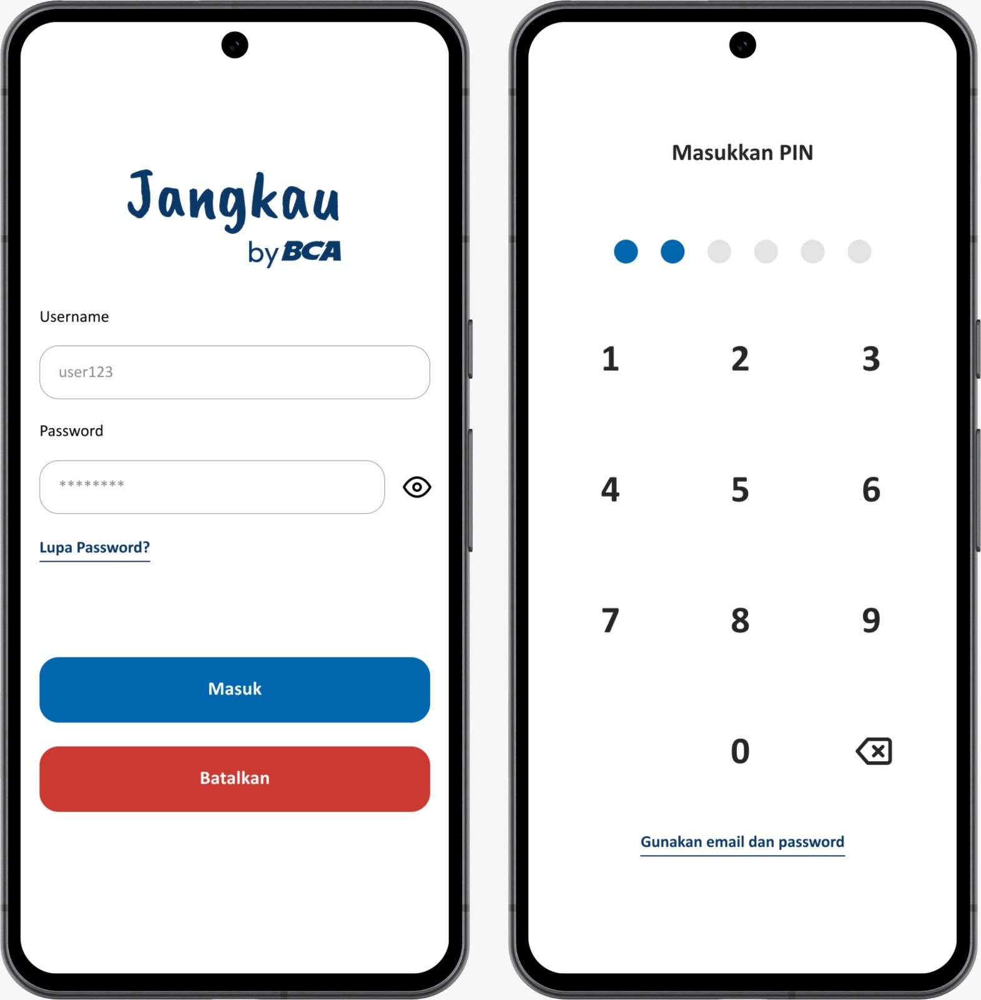
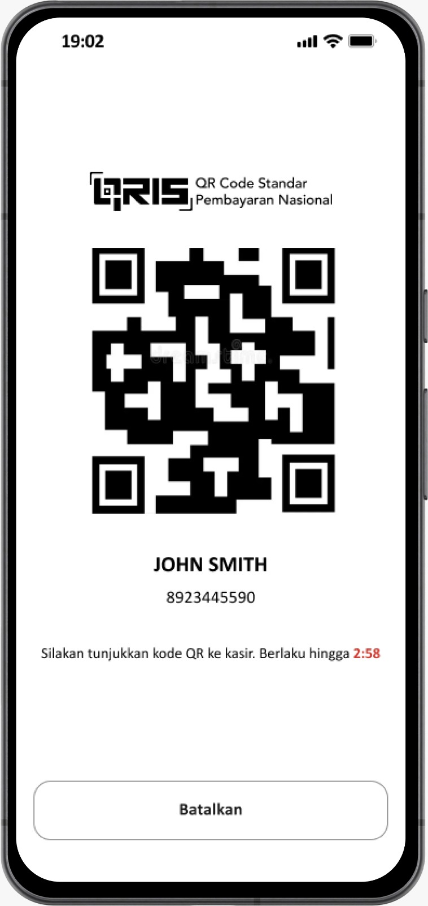
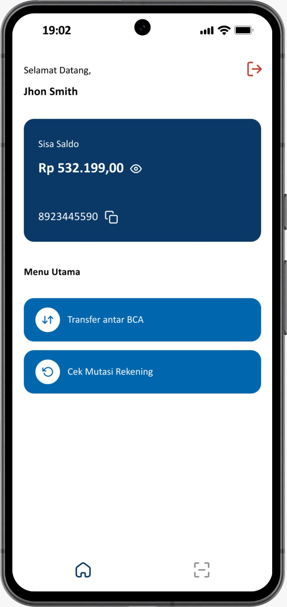
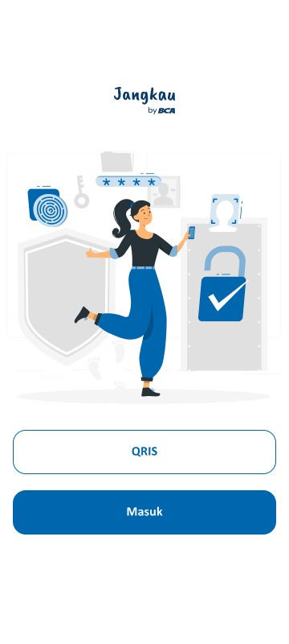
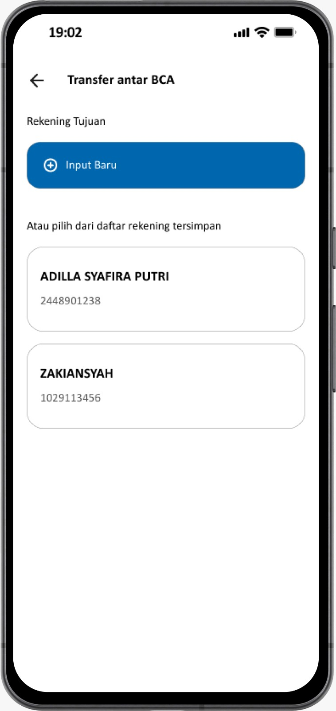
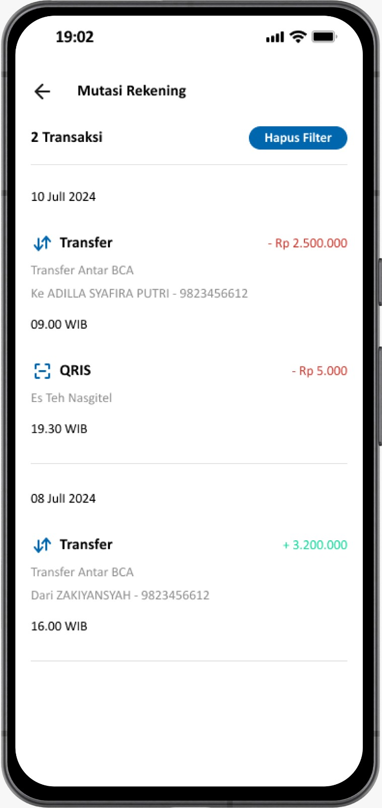

# Jangkau App
Jangkau is a digital banking platform designed to enhance financial accessibility, particularly for individuals with visual impairments for Final Project in BinarAcademy.With the rise of digital banking transactions, the platform offers essential banking services like balance checking, BCA account transfers, QR code payments, and transaction history monitoring. 

## Screenshots

### Auth Screen

### QR Code Generation

### Home Screen

### Initial Screen

### Saved Account

### Transaction History

